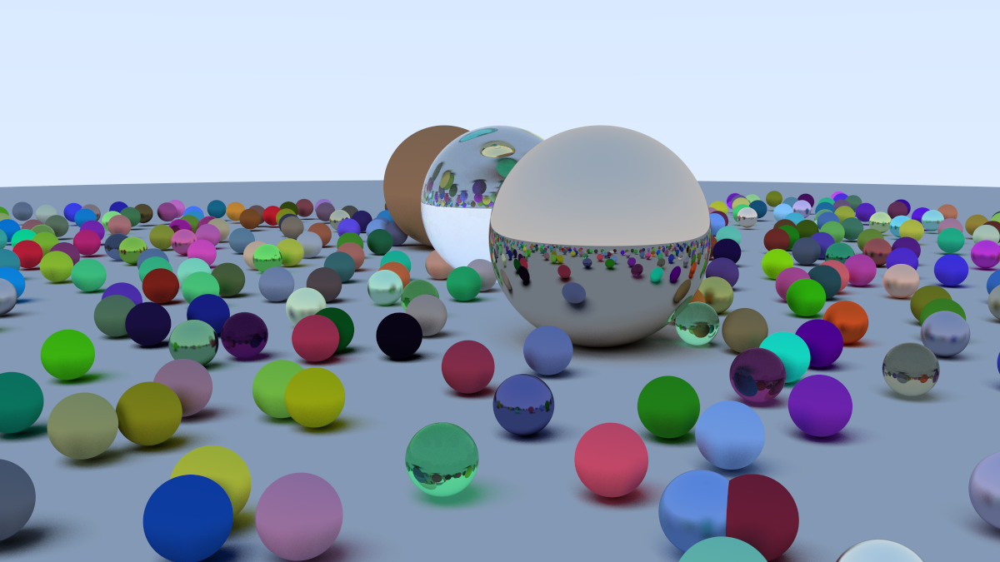

# Ray Tracing in One Weekend

My implementation of the ray tracer from the tutorial [_Ray Tracing in One Weekend_](https://raytracing.github.io/books/RayTracingInOneWeekend.html) by Peter Shirley.



## Requirements
- CMake >= 15.0
- A C++20-compliant compiler

## Build
```console
cmake -DCMAKE_BUILD_TYPE="Release" -B build/
cmake --build build/
```

## Run
```console
bin/raytracer
```
Then you can open `image.png` with your favorite image viewer.
